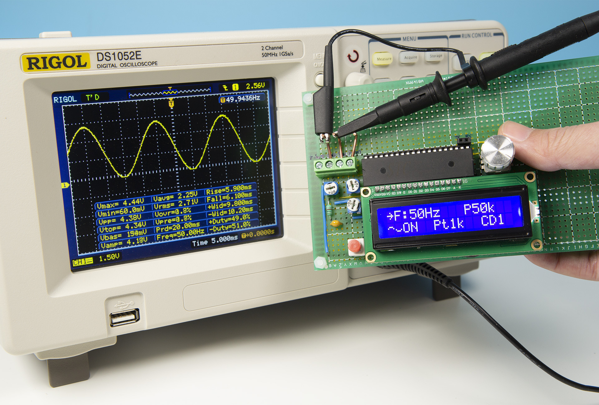
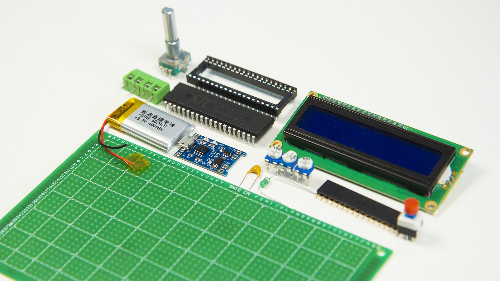
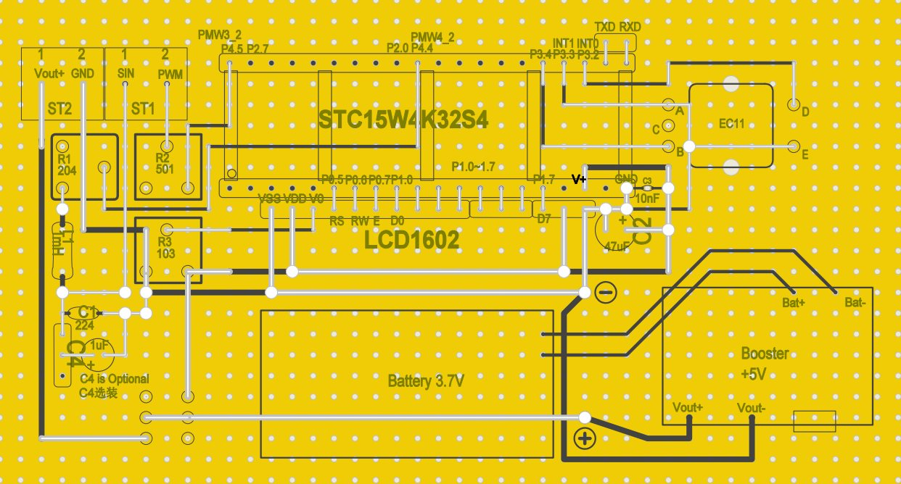

# Function_Generator_STC
使用STC单片机自制波形发生器 / DIY Function Generator with STC MCU

# Specification
* Output: Single Channel
* Square Waveform Frequency: 1Hz~2MHz
* Sine Waveform Frequency: 1Hz~10kHz
* Amplitude: VCC, about 5V
* Load ability: Not available
* MCU: STC15W4K32S4 @24MHz
* Display: LCD1602
* Controller: EC11 Encoder
# Parts List

* MCU: STC15W4K32S4 x 1 
* Display: LCD1602 x 1
* Row Pin Female: 
  * 16-Pin x 1
  * 2-Pin x 1
* Potentiometer: 
  * 10kΩ x 1
  * 200kΩ x 1
  * 500Ω x 1
* IC Socket 40-Pin x 1
* Inductor 1mH x 1 
* Capacitor:
  * 220nF x 1 
  * 10nF x 1
  * 47uF x 1
* EC11 Encoder x 1 
* Lithium Polymer Battery x 1 
* 5V booster x 1 
* Terminal 2-Pin x 2
* Push Switch x 1 
* Capacitor 1uF(optional) x 1
# Circuit

# Interface:
Bottom left shows the type of waveform(Square/Sine) and output status(ON/OFF)
* F: Frequency
* D: Duty of Square Waveform
* CD: Clock Division Coefficient (For information only)
* P: PWM frequency for generating Sine Waveform (For information only)
* Pt: Number of points for generating Sine Waveform (For information only)
# Operations:
* Single Click Encoder: Switch Frequency and Duty in Square Waveform Interface
* Double Click Encoder: Start/Stop Signal Output
* Long Press Encoder: Switch between Square Waveform/Sine Waveform/Voltage Information
* Rotate Encoder: Adjust Parameters
